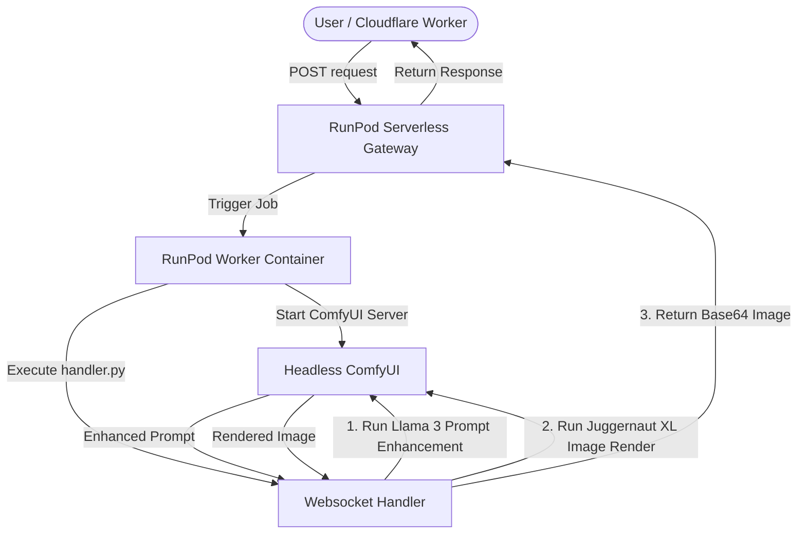

# runpod-comfyui-serverless

Stable Monolithic AI Generation Service for RunPod Serverless (Fallback Architecture).

## Overview

This repository preserves the original, stable monolithic AI pipeline. It runs a single-container RunPod serverless worker loading both the Llama 3 8B model and the Juggernaut XL (SDXL) model inside a ComfyUI environment.

> [!NOTE]
> This repository acts as our primary fallback safety layer. If the new modular microservice architecture (`PromptEnhancer` + `ClorobeImage`) encounters any service disruptions or integration issues, this monolithic stack remains ready to be deployed as an immediate rollback fallback.

## Key Features

- **All-in-One**: Combines prompt enhancement (Llama 3 8B) and image generation (Juggernaut XL) in a single workflow.
- **Workflow Orchestration**: Driven by custom JSON workflows loaded directly via ComfyUI.
- **Proven Stability**: Handtested and 100% verified to produce high-quality image generation with built-in prompt enhancement.
- **RunPod Handler**: Features a custom `handler.py` that processes input JSON requests, handles warm worker reuse, runs ComfyUI workflows headlessly via websockets/HTTP, and returns base64 images.

## Architecture

## Structure

- `Dockerfile`: Custom Docker configuration to build the unified ComfyUI environment.
- `handler.py`: Entrypoint for RunPod serverless worker orchestrating websocket communication with ComfyUI.
- `test_input.json`: Standard payload to run quick integration and regression checks on the endpoint.
- `workflows/`: Folder containing the verified JSON workflow templates for text enhancement and image generation.

## Restoring / Deploying as Fallback

If you need to roll back to this monolithic stack, you can build and deploy the Docker image in this folder:
1. Build the Docker image.
2. Push it to your registry.
3. Update the RunPod Endpoint to point to this container image.
